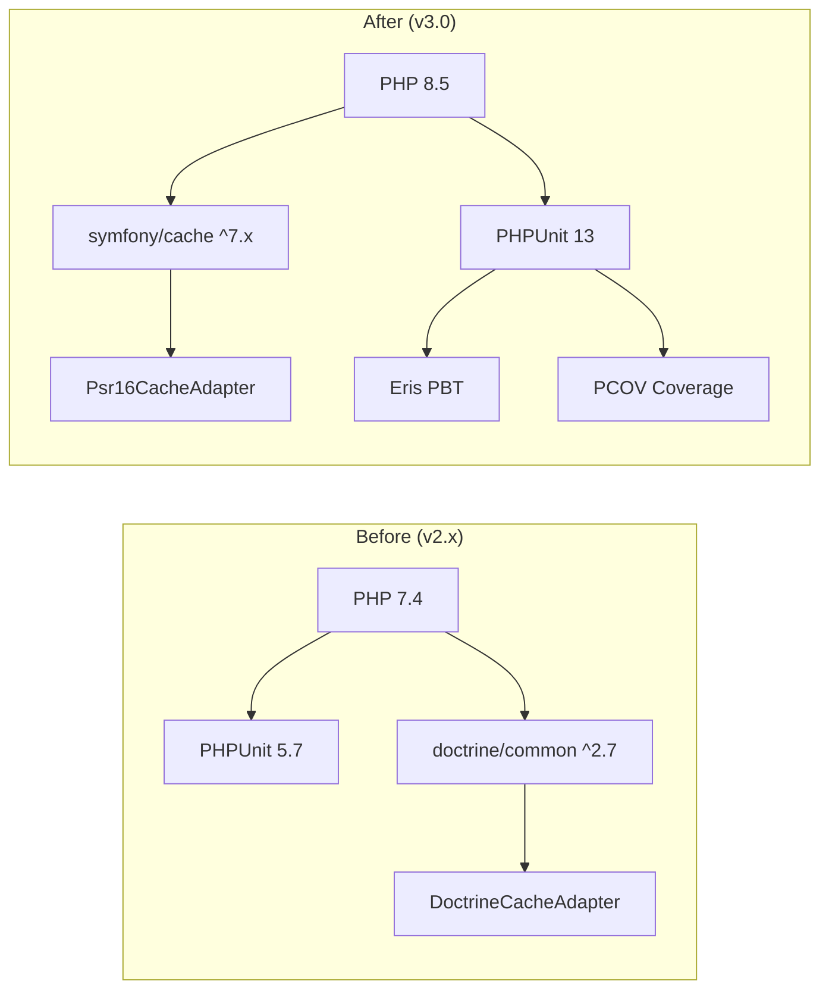
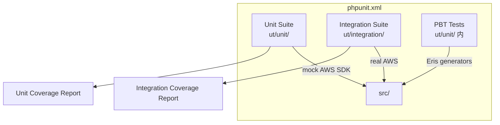
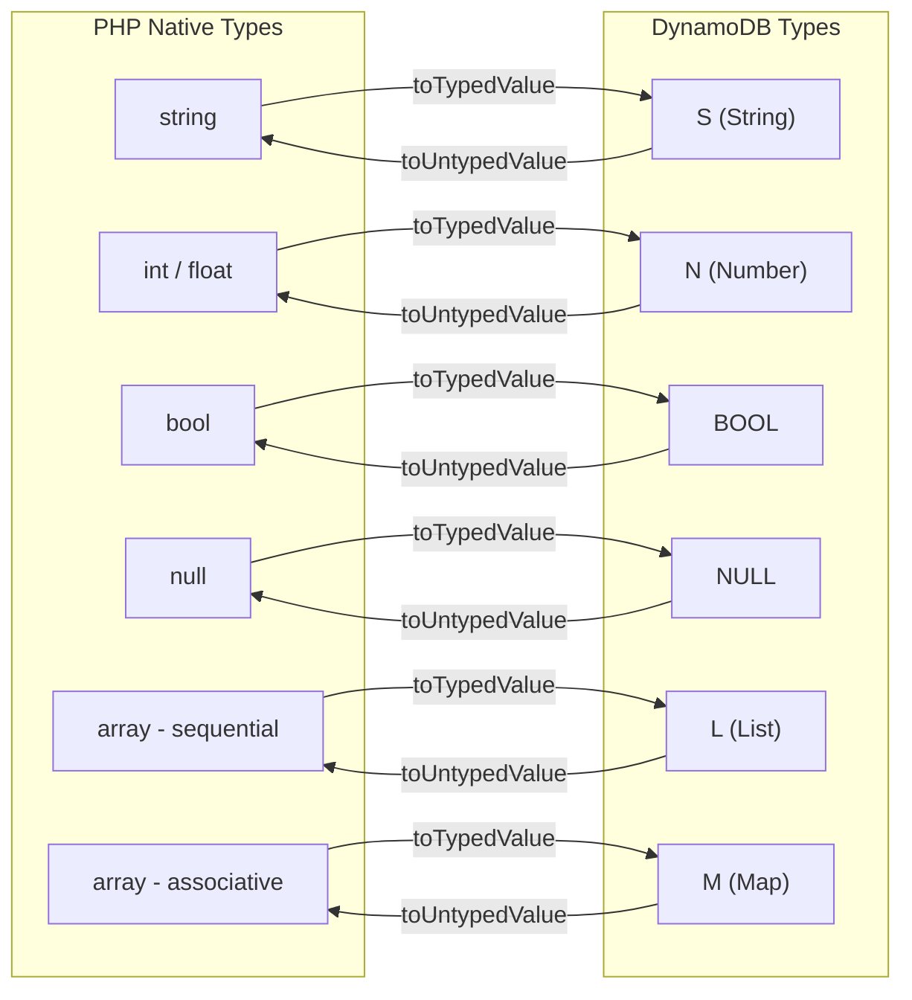

# Design Document

`<spec-dir>` — Release 3.0 的技术设计，涵盖升级路径、架构变更、组件接口、数据模型、正确性属性、错误处理与测试策略。

---

## Overview

本设计将 `oasis/aws-wrappers` 从 PHP 7.4 + PHPUnit 5.7 技术栈升级到 PHP 8.5 + PHPUnit 13，同时补齐单元测试、引入 PBT、建立覆盖率考核机制、完成源代码风格现代化。

### 升级路径（实施顺序约束）

```
Phase 1: 补齐纯单元测试（PHPUnit 5.7 API，PHP 7.4 运行）
Phase 2: PHPUnit 5.7 → 13 迁移（测试代码 API 升级）
Phase 3: PHP 7.4 → 8.5（composer.json require、依赖升级）
Phase 4: 源代码风格现代化（类型声明、属性提升、match、readonly 等）
Phase 5: PBT 引入 + 覆盖率考核机制建立
Phase 6: 文档同步更新
```

每个 Phase 完成后，全量测试必须通过，确保行为等价。

### 关键设计决策摘要

| 决策项 | 选择 | 理由 |
|--------|------|------|
| `doctrine/common` 替代 | `symfony/cache` | 提供 PSR-16 实现，AWS SDK 内置 `Aws\Psr16CacheAdapter` 可直接对接；社区活跃、长期维护 |
| PBT 库 | `giorgiosironi/eris` | PHP 生态唯一成熟的 PBT 库，兼容 PHPUnit 13.x 和 PHP 8.1-8.4+，提供丰富的 Generator |
| 覆盖率阈值 | Unit 80% / Integration 60% | Unit suite 覆盖全量源文件，阈值应较高；Integration suite 仅覆盖部分 AWS 交互路径，阈值适度 |
| `mixed` 类型策略 | 按场景判断 | 公共 API 参数可用 `mixed`，内部方法尽量使用更精确的类型（CR Q2 → C） |
| 集成测试跳过粒度 | 整个 suite 级别 | 通过 PHPUnit CLI `--testsuite unit` 排除整个 Integration suite（CR Q3 → A） |
| 覆盖率独立计算 | 执行方式灵活 | 只要最终能看到各 suite 各自的覆盖率数字即可（CR Q4 → C） |

---

## Architecture

### 升级前后对比



### 测试架构



### 目录结构变更

```
ut/
├── unit/                    # 纯单元测试（新增目录）
│   ├── AwsConfigDataProviderTest.php
│   ├── DynamoDbIndexTest.php
│   ├── DynamoDbItemTest.php          # 从 ut/ 迁移 + 补充 mock 版本
│   ├── DynamoDbManagerTest.php       # 新增 mock 版本
│   ├── DynamoDbTableTest.php         # 新增 mock 版本
│   ├── S3ClientTest.php              # 新增 mock 版本
│   ├── SnsPublisherTest.php
│   ├── SqsQueueTest.php              # 新增 mock 版本
│   ├── SqsMessageTest.php
│   ├── SqsReceivedMessageTest.php
│   ├── SqsSentMessageTest.php
│   ├── StsClientTest.php             # 新增 mock 版本
│   ├── TemporaryCredentialTest.php
│   ├── AwsSnsHandlerTest.php
│   ├── DynamoDb/
│   │   ├── MultiQueryCommandWrapperTest.php
│   │   ├── ParallelScanCommandWrapperTest.php
│   │   ├── QueryAsyncCommandWrapperTest.php
│   │   ├── QueryCommandWrapperTest.php
│   │   ├── ScanAsyncCommandWrapperTest.php
│   │   └── ScanCommandWrapperTest.php
│   └── Pbt/
│       └── DynamoDbItemCodecPbtTest.php   # PBT 测试
├── integration/             # 集成测试（从 ut/ 迁移）
│   ├── DynamoDbManagerIntegrationTest.php
│   ├── DynamoDbTableIntegrationTest.php
│   ├── DynamoDbItemIntegrationTest.php
│   ├── S3ClientIntegrationTest.php
│   ├── StsClientIntegrationTest.php
│   └── SqsQueueIntegrationTest.php
├── UTConfig.php             # 保留
├── ut-bootstrap.php         # 更新
├── tpl.ut.yml               # 保留
└── .gitignore               # 保留
```

---

## Components and Interfaces

### 1. `doctrine/common` → `symfony/cache` 替换

**变更范围**：仅影响 `AwsConfigDataProvider` 中的 IAM Role 凭证缓存逻辑。

**当前实现**：
```php
use Aws\DoctrineCacheAdapter;
use Doctrine\Common\Cache\FilesystemCache;

$cacheAdapter = new DoctrineCacheAdapter(new FilesystemCache($cacheFile));
$data['credentials'] = CredentialProvider::cache(
    CredentialProvider::ecsCredentials(), $cacheAdapter
);
```

**目标实现**：
```php
use Aws\Psr16CacheAdapter;
use Symfony\Component\Cache\Adapter\FilesystemAdapter;
use Symfony\Component\Cache\Psr16Cache;

$psr6Cache = new FilesystemAdapter('aws_credentials', 0, $cacheFile);
$psr16Cache = new Psr16Cache($psr6Cache);
$cacheAdapter = new Psr16CacheAdapter($psr16Cache);
$data['credentials'] = CredentialProvider::cache(
    CredentialProvider::ecsCredentials(), $cacheAdapter
);
```

**选型理由**：
- `Aws\Psr16CacheAdapter` 是 AWS SDK v3 内置类，接受 PSR-16 `CacheInterface` 实例
- `symfony/cache` 提供 `Psr16Cache`（PSR-16 包装器）和 `FilesystemAdapter`（PSR-6 文件缓存）
- 无需引入额外适配层，依赖链清晰：`symfony/cache` → PSR-16 → AWS SDK
- `doctrine/cache` 已标记为 deprecated，不推荐新项目使用

### 2. PHPUnit 13 配置

**`phpunit.xml` 目标结构**：

```xml
<?xml version="1.0" encoding="UTF-8"?>
<phpunit xmlns:xsi="http://www.w3.org/2001/XMLSchema-instance"
         xsi:noNamespaceSchemaLocation="vendor/phpunit/phpunit/phpunit.xsd"
         bootstrap="ut/ut-bootstrap.php"
         colors="true"
         cacheDirectory=".phpunit.cache">
    <testsuites>
        <testsuite name="unit">
            <directory>ut/unit</directory>
        </testsuite>
        <testsuite name="integration">
            <directory>ut/integration</directory>
        </testsuite>
    </testsuites>
    <source>
        <include>
            <directory>src</directory>
        </include>
    </source>
</phpunit>
```

**关键变更**：
- Schema 从 `http://schema.phpunit.de/5.7/phpunit.xsd` 更新为本地 vendor 路径
- 移除 `backupGlobals`、`backupStaticAttributes`（PHPUnit 13 已移除）
- 使用 `<source>` 替代旧版 `<filter>/<whitelist>` 配置覆盖率源码范围
- 双 test suite：`unit`（`ut/unit/`）和 `integration`（`ut/integration/`）

**集成测试跳过方式**（CR Q3 → A）：
```bash
# 仅运行 unit suite
php vendor/bin/phpunit --testsuite unit

# 仅运行 integration suite（需 AWS 凭证）
php vendor/bin/phpunit --testsuite integration

# 运行全部
php vendor/bin/phpunit
```

### 3. 测试 API 迁移

| 变更项 | PHPUnit 5.7 | PHPUnit 13 |
|--------|-------------|------------|
| 基类 | `\PHPUnit_Framework_TestCase` | `PHPUnit\Framework\TestCase` |
| `setUp()` 签名 | `function setUp()` | `protected function setUp(): void` |
| `tearDown()` 签名 | `function tearDown()` | `protected function tearDown(): void` |
| Mock 创建 | `$this->getMock()` | `$this->createMock()` |
| 断言 | `assertContains` (string) | `assertStringContainsString` |
| 注解 | `@test`, `@depends` | `#[Test]`, `#[Depends]`（或保留 docblock） |

### 4. 覆盖率收集与考核

**驱动**：PCOV（本机 `php74` 和 `php` 均已安装）

**执行方式**（CR Q4 → C，灵活执行）：

```bash
# Unit suite 覆盖率
php -dpcov.enabled=1 vendor/bin/phpunit --testsuite unit \
    --coverage-text --coverage-clover=coverage-unit.xml

# Integration suite 覆盖率
php -dpcov.enabled=1 vendor/bin/phpunit --testsuite integration \
    --coverage-text --coverage-clover=coverage-integration.xml
```

**阈值考核**：

| Suite | 行覆盖率阈值 | 考核方式 |
|-------|-------------|---------|
| Unit | 80% | `--coverage-text` 输出 + 脚本检查 exit code |
| Integration | 60% | 同上 |

阈值通过一个轻量 shell 脚本 `check-coverage.sh` 实现：解析 `--coverage-text` 输出中的 `Lines:` 百分比，低于阈值则 `exit 1`。

**设计理由**：
- Unit suite 覆盖全量 20 个可测试源文件（不含 4 个纯接口），80% 是合理的基线目标
- Integration suite 仅覆盖 6 个有真实 AWS 交互的类，且部分路径（错误重试、边界条件）难以在集成环境触发，60% 是务实的起点
- 阈值可在后续迭代中逐步提高

### 5. PBT 集成

**库**：`giorgiosironi/eris`

**兼容性**：PHP 8.1-8.4+，PHPUnit 10.x-13.x

**集成方式**：
```php
use Eris\TestTrait;
use PHPUnit\Framework\TestCase;

class DynamoDbItemCodecPbtTest extends TestCase
{
    use TestTrait;

    public function testRoundTrip(): void
    {
        $this->forAll(/* generators */)
            ->then(function ($value) {
                // assert round-trip property
            });
    }
}
```

**迭代次数配置**：Eris 默认 100 次迭代，满足 Requirement 7 AC5 的最低要求。可通过 `->withMaxSize(200)` 或环境变量调整。

### 6. 源代码风格现代化

**适用范围**：`src/` 下全部 PHP 文件（24 个，其中 4 个为纯接口文件，20 个含可测试实现）

**变更策略**（CR Q2 → C）：

| 特性 | 适用规则 |
|------|---------|
| 参数类型声明 | 公共 API 参数类型不确定时可用 `mixed`；内部方法尽量使用精确类型 |
| 返回类型声明 | 所有方法添加返回类型；不确定时公共 API 可用 `mixed` |
| 属性类型声明 | 所有属性添加类型声明 |
| 构造器属性提升 | 简单赋值场景使用（如 `TemporaryCredential`、`DynamoDbIndex`） |
| `match` 表达式 | 替换简单 `switch`（如 `DynamoDbItem::toUntypedValue`、`SnsPublisher::publish`） |
| `readonly` | 构造后不再变更的属性（如 `SqsQueue::$name`、`DynamoDbTable::$tableName`） |
| 联合类型 | 如 `int\|float`、`string\|null` |

**公共 API 保护**（Requirement 6 AC8）：方法名、参数顺序、行为契约不变。仅添加类型声明，不改变方法签名的语义。

---

## Data Models

### DynamoDbItem 类型系统映射

`DynamoDbItem` 是本项目的核心数据转换层，负责 PHP 原生类型与 DynamoDB 类型系统之间的双向转换。



**转换规则**：

| PHP 类型 | DynamoDB 类型 | 特殊行为 |
|----------|--------------|---------|
| `string` | `S` | 空字符串 → `NULL` |
| `int` / `float` | `N` | 存储为字符串；读取时 `intval($v) == $v` 则返回 `int`，否则 `float` |
| `bool` | `BOOL` | 直接映射 |
| `null` | `NULL` | `["NULL" => true]` |
| `array`（顺序） | `L` | 键为连续整数 0, 1, 2... |
| `array`（关联） | `M` | 键非连续整数 |
| Binary | `B` | base64 编码/解码；空值 → `NULL` |

**已知边界行为**：
- 空字符串被转换为 `NULL` 类型（DynamoDB 不支持空字符串属性值）
- 非数字值传入 `N` 类型时被转换为 `"0"`
- `determineAttributeType` 对 `bool` 的检测在 `int`/`float` 之后，因此 PHP 的 `true`/`false` 不会被误判为数字（`is_int(true)` 在 PHP 中返回 `false`）

### SQS 消息序列化

`SqsQueue` 使用 `base64_serialize` 标记实现非字符串消息的自动序列化：

```
发送: 非字符串 payload → base64_encode(serialize($payload)) + SERIALIZATION_FLAG
接收: 检测 SERIALIZATION_FLAG → unserialize(base64_decode($body))
```

---

## Correctness Properties

*A property is a characteristic or behavior that should hold true across all valid executions of a system — essentially, a formal statement about what the system should do. Properties serve as the bridge between human-readable specifications and machine-verifiable correctness guarantees.*

本项目中 PBT 适用于 `DynamoDbItem` 的类型转换逻辑（Codec）。该逻辑是纯函数式的双向映射，输入空间大（任意嵌套的 PHP 值），非常适合通过随机生成输入来发现边界情况。

其余 Requirements（PHPUnit 升级、PHP 版本升级、代码风格、覆盖率配置、文档更新等）属于配置/结构性变更，不适合 PBT，使用 example-based 单元测试和 smoke 测试覆盖。

### Property 1: Codec Round-Trip（untyped → typed → untyped）

*For any* valid PHP value（string、int、float、bool、null、sequential array、associative array，及其任意嵌套组合），通过 `DynamoDbItem::createFromArray` 编码为 DynamoDB 类型格式，再通过 `toArray` 解码回 PHP 原生类型，结果 SHALL 等价于原始输入。

**注意**：空字符串是已知的有损转换（`""` → `NULL` → `null`），生成器应排除空字符串或在断言中处理此边界。

**Validates: Requirements 7.2**

### Property 2: Typed Codec Round-Trip（typed → item → typed）

*For any* valid DynamoDB typed array（包含 `S`、`N`、`BOOL`、`NULL`、`L`、`M` 类型标记的嵌套结构），通过 `DynamoDbItem::createFromTypedArray` 创建 item，再通过 `getData` 获取内部表示，结果 SHALL 与原始 typed array 完全相同。

**Validates: Requirements 7.3**

### Property 3: Codec Idempotence

*For any* valid PHP value，将其通过 `createFromArray` → `toArray` 转换一次得到 `result1`，再将 `result1` 通过 `createFromArray` → `toArray` 转换第二次得到 `result2`，则 `result1` SHALL 等于 `result2`。

即：类型转换在首次应用后达到稳定状态，重复应用不再改变结果。数学表达：`f(f(x)) == f(x)`，其中 `f = toArray ∘ createFromArray`。

**Validates: Requirements 7.4**

---

## Error Handling

### Phase 1: 补齐单元测试

| 场景 | 处理方式 |
|------|---------|
| `AwsConfigDataProvider` 缺少 `region` | 抛出 `MandatoryValueMissingException`，单元测试验证 |
| `AwsConfigDataProvider` 缺少凭证信息 | 抛出 `MandatoryValueMissingException`，单元测试验证 |
| `DynamoDbItem` 无法识别的类型 | 抛出 `InvalidDataTypeException` 或 `RuntimeException`，单元测试验证 |
| `SqsQueue` 无效属性名 | 抛出 `InvalidArgumentException`，单元测试验证 |
| `SqsReceivedMessage` MD5 校验失败 | 抛出 `UnexpectedValueException`，单元测试验证 |
| `S3Client` 无效 S3 路径格式 | 抛出 `InvalidArgumentException`，单元测试验证 |

### Phase 2-3: PHPUnit / PHP 升级

| 场景 | 处理方式 |
|------|---------|
| PHPUnit 13 API 不兼容 | 逐文件迁移，每次迁移后运行测试确认 |
| PHP 8.5 deprecation warning | 修复源代码中的弃用用法，确保零 warning |
| 依赖不兼容 | `composer install` 失败时逐个排查依赖版本 |

### Phase 4: 代码风格升级

| 场景 | 处理方式 |
|------|---------|
| 类型声明导致 `TypeError` | 说明现有代码存在隐式类型转换，需调整类型声明或添加显式转换 |
| `readonly` 属性被意外写入 | 编译期错误，修复赋值逻辑 |
| `match` 表达式未覆盖所有分支 | 添加 `default` 分支或确保穷尽匹配 |

### Phase 5: PBT

| 场景 | 处理方式 |
|------|---------|
| PBT 发现 round-trip 失败 | 分析 shrunk 反例，修复 Codec 逻辑或调整生成器排除已知有损转换 |
| PBT 超时 | 检查生成器复杂度，限制嵌套深度 |

---

## Testing Strategy

### 总体方针

采用双重测试策略：

1. **Unit Tests（example-based）**：覆盖全量 20 个可测试源文件的具体行为、边界条件、错误路径
2. **Property Tests（PBT）**：覆盖 `DynamoDbItem` Codec 的通用正确性属性
3. **Integration Tests**：验证真实 AWS 服务交互（需凭证，可跳过）

### PBT 配置

- **库**：`giorgiosironi/eris`（`composer require --dev giorgiosironi/eris`）
- **最低迭代次数**：100 次/property（Eris 默认值）
- **标签格式**：每个 PBT 测试方法的 docblock 或注释中标注：
  ```
  Feature: release-3.0, Property 1: Codec Round-Trip
  ```
- **生成器策略**：
  - 基础类型：`Generators::string()`、`Generators::int()`、`Generators::float()`、`Generators::bool()`、`Generators::constant(null)`
  - 复合类型：自定义递归生成器，生成嵌套 array（list / map），深度限制 3 层
  - 边界值：空字符串（已知有损）、极大/极小数字、深层嵌套

### 单元测试覆盖矩阵

| 源文件 | 测试类 | 关键测试点 |
|--------|--------|-----------|
| `AwsConfigDataProvider` | `AwsConfigDataProviderTest` | region 校验、凭证处理（profile/credentials/TemporaryCredential/IAM Role/env）、版本设置 |
| `DynamoDbIndex` | `DynamoDbIndexTest` | 构造、getName 自动生成、equals 比较、getKeySchema、getProjection |
| `DynamoDbItem` | `DynamoDbItemTest` | 类型转换（各类型）、ArrayAccess、createFromArray/createFromTypedArray、边界值 |
| `DynamoDbManager` | `DynamoDbManagerTest` | listTables（分页 mock）、createTable、deleteTable、waitForTable* |
| `DynamoDbTable` | `DynamoDbTableTest` | get/set/delete（mock DynamoDbClient）、batchGet/batchPut/batchDelete、query/scan 委托 |
| `S3Client` | `S3ClientTest` | 构造（endpoint 生成逻辑：cn-/us-east-1/其他）、getPresignedUri 路径解析 |
| `SnsPublisher` | `SnsPublisherTest` | publish 多通道消息结构、publishToSubscribedSQS 序列化 |
| `SqsQueue` | `SqsQueueTest` | createQueue、sendMessage/sendMessages、receiveMessage、deleteMessage、属性管理 |
| `SqsMessage` | `SqsMessageTest` | 构造、getter |
| `SqsReceivedMessage` | `SqsReceivedMessageTest` | MD5 校验、反序列化（base64_serialize / JSON / plain）、getAttribute |
| `SqsSentMessage` | `SqsSentMessageTest` | 构造、MD5 字段 |
| `StsClient` | `StsClientTest` | 构造、getTemporaryCredential mock |
| `TemporaryCredential` | `TemporaryCredentialTest` | 属性赋值与读取 |
| `AwsSnsHandler` | `AwsSnsHandlerTest` | write（单条）、handleBatch（批量）、publisher 交互 |
| 6 个 Command Wrapper | 各自 Test 类 | 参数构建、回调处理、分页/并发逻辑 |

### 覆盖率考核

| Suite | 阈值 | 执行命令 |
|-------|------|---------|
| Unit | 80% line | `php -dpcov.enabled=1 vendor/bin/phpunit --testsuite unit --coverage-text` |
| Integration | 60% line | `php -dpcov.enabled=1 vendor/bin/phpunit --testsuite integration --coverage-text` |

阈值检查通过 `check-coverage.sh` 脚本实现，解析 `--coverage-text` 输出，低于阈值则 `exit 1`。

### 测试执行命令汇总

```bash
# 全量单元测试（无需 AWS 凭证）
php vendor/bin/phpunit --testsuite unit

# 全量集成测试（需 AWS 凭证）
php vendor/bin/phpunit --testsuite integration

# 全部测试
php vendor/bin/phpunit

# 单元测试 + 覆盖率
php -dpcov.enabled=1 vendor/bin/phpunit --testsuite unit --coverage-text

# 集成测试 + 覆盖率
php -dpcov.enabled=1 vendor/bin/phpunit --testsuite integration --coverage-text
```

---

## Impact Analysis

### 受影响的 State 文档

| 文件 | 受影响 Section | 变更内容 |
|------|---------------|---------|
| `docs/state/architecture.md` | 测试 | PHPUnit ^5.7 → 13，测试目录 `ut/` → `ut/unit/` + `ut/integration/`，新增 PBT 和覆盖率机制 |
| `docs/state/architecture.md` | 依赖 | `doctrine/common ^2.7` → `symfony/cache ^7.x`，`phpunit/phpunit ^5.7` → `^13`，`league/uri ^4.2` → 兼容版本 |
| `PROJECT.md` | 技术栈 | PHP 版本、PHPUnit 版本、核心依赖版本 |
| `PROJECT.md` | 构建与测试命令 | 新增 `--testsuite unit` / `--testsuite integration` 命令，新增覆盖率命令 |

### 现有行为变化

- **运行时行为**：源代码添加类型声明后，原本接受隐式类型转换的调用点可能触发 `TypeError`。设计通过 "公共 API 参数可用 `mixed`" 策略（CR Q2 → C）和全量单元测试回归来控制此风险。
- **测试执行行为**：现有 `phpunit.xml` 的 `basic` suite 将被替换为 `unit` + `integration` 双 suite。直接运行 `vendor/bin/phpunit` 的行为从"只跑 6 个集成测试"变为"跑全部测试（unit + integration）"。
- **缓存行为**：IAM Role 凭证缓存从 `Doctrine\Common\Cache\FilesystemCache` 切换到 `Symfony\Component\Cache\Adapter\FilesystemAdapter`。缓存目录路径不变，但底层存储格式可能不同——首次部署后旧缓存文件将自动失效并重建，不影响功能。

### 数据模型变更

不涉及。本次升级不改变任何数据模型（DynamoDB 类型映射、SQS 消息格式等均保持不变）。

### 外部系统交互变化

不涉及。AWS SDK 保持 ^3.x，所有 AWS API 调用方式不变。

### 配置项变更

| 配置项 | 变更类型 | 说明 |
|--------|---------|------|
| `composer.json` → `require.php` | 修改 | 新增 `>=8.5` 约束 |
| `composer.json` → `require.doctrine/common` | 删除 | 替换为 `symfony/cache` |
| `composer.json` → `require.symfony/cache` | 新增 | `^7.x` |
| `composer.json` → `require-dev.phpunit/phpunit` | 修改 | `^5.7` → `^13` |
| `composer.json` → `require-dev.giorgiosironi/eris` | 新增 | PBT 库 |
| `phpunit.xml` | 重写 | Schema 升级、双 suite、`<source>` 配置 |
| `check-coverage.sh` | 新增 | 覆盖率阈值检查脚本 |

---

## Socratic Review

### Q: 为什么选择 `symfony/cache` 而非 `doctrine/cache`？

A: `doctrine/cache` 已被 Doctrine 官方标记为 deprecated，不推荐新项目使用。`symfony/cache` 提供 PSR-6 和 PSR-16 实现，社区活跃、长期维护。AWS SDK v3 内置 `Aws\Psr16CacheAdapter`，可直接对接 `symfony/cache` 的 `Psr16Cache`，无需额外适配层。

### Q: 为什么选择 Eris 作为 PBT 库？

A: Eris 是 PHP 生态中唯一成熟的 QuickCheck 移植，明确支持 PHPUnit 10.x-13.x 和 PHP 8.1-8.4+。它提供丰富的内置 Generator（string、int、float、bool、constant、oneOf、tuple、associative 等），支持 shrinking，与 PHPUnit TestCase 通过 `TestTrait` 无缝集成。其他选项（如 Proposition）过于轻量，缺少 shrinking 和复合 Generator。

### Q: 覆盖率阈值 80%/60% 的依据是什么？

A: Unit suite 覆盖全量 20 个可测试源文件（不含 4 个纯接口），每个文件都有对应的 mock 测试，80% 是业界常见的合理基线。Integration suite 仅覆盖 6 个有真实 AWS 交互的类，且部分错误路径（网络超时、AWS 限流重试等）难以在集成环境可靠触发，60% 是务实的起点。两个阈值都可在后续迭代中根据实际覆盖率逐步提高。

### Q: 目录结构为什么从 `ut/` 平铺改为 `ut/unit/` + `ut/integration/`？

A: 现有 `ut/` 目录下的 6 个测试文件全部是集成测试（依赖真实 AWS 资源）。新增的纯单元测试需要与集成测试物理分离，以便 PHPUnit 通过 `--testsuite` 参数独立运行。`ut/unit/` 和 `ut/integration/` 的二级目录结构清晰地映射到 `phpunit.xml` 中的两个 test suite。

### Q: `mixed` 类型策略是否会导致类型安全性不足？

A: 不会。CR Q2 → C 的决策是按场景判断：公共 API 参数（如 `DynamoDbItem::toTypedValue` 的 `$v` 参数）确实接受多种类型，使用 `mixed` 是准确的类型声明。内部方法（如 `determineAttributeType` 的返回值）类型是确定的 `string`，应使用精确类型。这种策略在类型安全性和 API 兼容性之间取得了平衡。

### Q: PBT 的 round-trip property 如何处理空字符串的有损转换？

A: `DynamoDbItem` 将空字符串转换为 `NULL` 类型（DynamoDB 不支持空字符串属性值），这是已知的有损行为。PBT 生成器有两种处理方式：(1) 排除空字符串，仅生成非空字符串；(2) 在断言中特殊处理空字符串 → `null` 的映射。设计推荐方式 (1)，因为空字符串的行为已由 example-based 单元测试覆盖。

### Q: 升级路径中 Phase 1 使用 PHPUnit 5.7 API 写测试，Phase 2 又要迁移到 PHPUnit 13，是否浪费？

A: 不浪费。Phase 1 的目的是在当前稳定环境（PHP 7.4 + PHPUnit 5.7）下建立回归基线。如果直接用 PHPUnit 13 API 写测试，就无法在升级前验证现有代码的行为正确性。Phase 2 的 API 迁移是机械性的（类名替换、签名调整），工作量可控。这个顺序确保了每一步都有可运行的测试作为安全网。

### Q: CR 决策是否全部在设计中体现？

A: 已逐一检查：
- **Q1 → A**：所有源文件都有 mock 版本的单元测试 → 体现在测试覆盖矩阵和目录结构中
- **Q2 → C**：`mixed` 按场景判断 → 体现在 "源代码风格现代化" 的类型策略表中
- **Q3 → A**：整个 suite 级别跳过 → 体现在 PHPUnit 配置和执行命令中
- **Q4 → C**：覆盖率执行方式灵活 → 体现在覆盖率收集方案中

### Q: 模块间是否存在循环依赖或过度耦合？

A: 不存在。本项目的依赖关系是单向的：各 AWS 服务封装类（`DynamoDbTable`、`SqsQueue`、`S3Client` 等）依赖 `AwsConfigDataProvider` 获取配置，`DynamoDbTable` 依赖 `DynamoDbItem` 做类型转换，Command Wrapper 类被 `DynamoDbTable` 调用。没有反向依赖或循环引用。本次升级不改变模块间依赖关系。

### Q: 是否有过度设计的部分？

A: 没有。设计严格限定在 requirements 要求的范围内：不引入新的抽象层、不预留扩展点、不添加 requirements 未要求的功能。`check-coverage.sh` 是最轻量的阈值检查方案，避免了引入额外的覆盖率工具或框架。


---

## Gatekeep Log

**校验时间**: 2025-07-15
**校验结果**: ⚠️ 已修正后通过

### 修正项

- [结构] 补充缺失的 `## Impact Analysis` section，覆盖受影响的 state 文档、现有行为变化、数据模型变更、外部系统交互、配置项变更五个维度
- [内容] 源文件数量从 "21 个" 修正为 "24 个（其中 4 个纯接口，20 个可测试）"——实际 `src/` 下有 24 个 PHP 文件，包含 `PublisherInterface`、`QueueInterface`、`QueueMessageInterface`、`CredentialProviderInterface` 4 个接口文件
- [内容] Socratic Review 补充两个维度：模块间循环依赖检查、过度设计检查

### 合规检查

- [x] 无 TBD / TODO / 待定 / 占位符
- [x] 无空 section 或不完整列表
- [x] 内部引用一致（requirements 编号、术语引用、CR 决策编号）
- [x] 代码块语法正确（语言标注、闭合）
- [x] 无 markdown 格式错误
- [x] 一级标题 `# Design Document` 存在
- [x] 技术方案主体存在，承接了 requirements 中全部 9 条需求
- [x] 接口签名 / 数据模型有明确定义（`symfony/cache` 替换代码、`phpunit.xml` 目标结构、PHPUnit API 迁移表、PBT 集成代码、覆盖率命令）
- [x] 各 section 之间使用 `---` 分隔
- [x] `## Impact Analysis` 存在，覆盖 state 文档、行为变化、数据模型、外部系统、配置项
- [x] Socratic Review 覆盖充分（技术选型理由、覆盖率依据、目录结构、mixed 策略、PBT 边界、升级路径合理性、CR 决策体现、循环依赖、过度设计）
- [x] Requirements 全覆盖：Req 1（补 UT）→ 目录结构 + 覆盖矩阵；Req 2（PHPUnit 13）→ 配置 + API 迁移表；Req 3（集成测试迁移）→ integration suite；Req 4（PHP 8.5）→ 升级路径 Phase 3；Req 5（依赖升级）→ symfony/cache 替换；Req 6（代码风格）→ 现代化策略表；Req 7（PBT）→ Correctness Properties + PBT 集成；Req 8（覆盖率）→ 覆盖率收集与考核；Req 9（文档更新）→ Phase 6
- [x] Requirements CR 决策全部体现（Q1→A、Q2→C、Q3→A、Q4→C）
- [x] 技术选型有明确理由（symfony/cache、Eris、PCOV、覆盖率阈值）
- [x] 接口定义可执行，能让 task 独立编码
- [x] 与 state 文档中描述的现有架构一致
- [x] 无过度设计
- [○] Graphify 校验（graphify_ready = false，GRAPH_REPORT.md 不存在，跳过）

### Clarification Round

**状态**: 已完成

**Q1:** Design 中 Phase 1（补齐单元测试）涉及 20 个可测试源文件的 mock 测试编写。在拆分 tasks 时，是按源文件逐个拆分（每个源文件一个 task），还是按功能模块分组（如 DynamoDB 相关一组、SQS 相关一组、其他一组）？
- A) 按源文件逐个拆分——每个源文件对应一个独立 task，粒度最细，便于并行和进度追踪
- B) 按功能模块分组——DynamoDB（DynamoDbItem/Manager/Table/Index + 6 个 Command Wrapper）、SQS（SqsQueue/Message/ReceivedMessage/SentMessage）、其他（S3Client/StsClient/SnsPublisher/AwsConfigDataProvider/TemporaryCredential/AwsSnsHandler）各为一个 task
- C) 按依赖层次分组——先做无外部依赖的简单类（TemporaryCredential、DynamoDbIndex、SqsMessage 等），再做需要 mock AWS SDK 的复杂类（DynamoDbTable、SqsQueue 等）
- D) 其他（请说明）

**A:** B — 按功能模块分组：DynamoDB 一组、SQS 一组、其他一组

**Q2:** Phase 2（PHPUnit 5.7 → 13 迁移）和 Phase 3（PHP 7.4 → 8.5 + 依赖升级）在 tasks 中是各自作为一个 task，还是需要进一步拆分？Phase 3 中 `doctrine/common` → `symfony/cache` 的替换是否应独立为单独 task？
- A) Phase 2 和 Phase 3 各一个 task，`symfony/cache` 替换包含在 Phase 3 task 中
- B) Phase 2 一个 task；Phase 3 拆为两个 task：依赖升级（含 `symfony/cache` 替换）+ PHP 版本约束更新
- C) Phase 2 一个 task；Phase 3 拆为三个 task：`symfony/cache` 替换（独立）+ 其他依赖升级 + PHP 版本约束更新
- D) 其他（请说明）

**A:** A — Phase 2 和 Phase 3 各一个 task，symfony/cache 替换包含在 Phase 3 中

**Q3:** Phase 4（源代码风格现代化）涉及 24 个源文件的类型声明、属性提升、match、readonly 等改造。拆分策略是什么？
- A) 整个 Phase 4 作为一个 task——风格升级是机械性的全量操作，拆分反而增加协调成本
- B) 按变更类型拆分——类型声明（参数+返回值+属性）一个 task、构造器属性提升一个 task、match/readonly 一个 task
- C) 按源文件模块分组——与 Q1 的分组方式一致
- D) 其他（请说明）

**A:** A — 整个 Phase 4 作为一个 task

**Q4:** Phase 5 中 PBT 引入和覆盖率考核机制是作为一个 task 还是拆为两个独立 task？两者在实现上没有依赖关系，但都属于测试基础设施。
- A) 合并为一个 task——两者都是测试基础设施增强，一起完成更连贯
- B) 拆为两个独立 task——PBT（Eris 集成 + 3 个 property 测试）和覆盖率（phpunit.xml 配置 + check-coverage.sh 脚本）各自独立
- C) 其他（请说明）

**A:** A — 合并为一个 task
